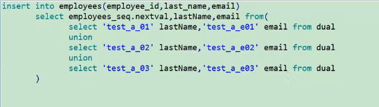
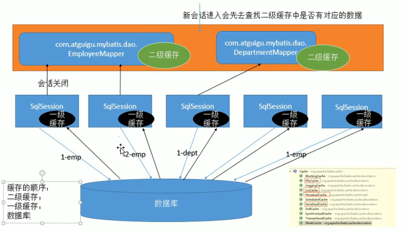

>分步查询，发现会发送两次SQL

>测试延迟加载
@Test
public void queryPersonAndAddressByStepLazyOut(){
SqlSession sqlSession = null;
    try {
        sqlSession = sqlSessionUtils.getSqlSession();
        PersonMapper mapper = sqlSession.getMapper(PersonMapper.class);
        Person person = mapper.queryPersonByIdWithStep(1);
        //在这里只获取第一张表的某个字段
        System.out.println(person.getName());
    } catch (IOException e) {
            e.printStackTrace();
        }finally {
            assert sqlSession != null;
            sqlSession.close();
    }
}

发现只有一条查询语句。
> 
Oracle支持的批量插入方式

mybatis查询缓存
